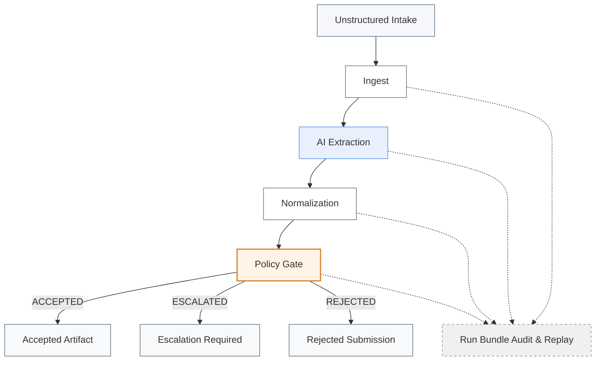
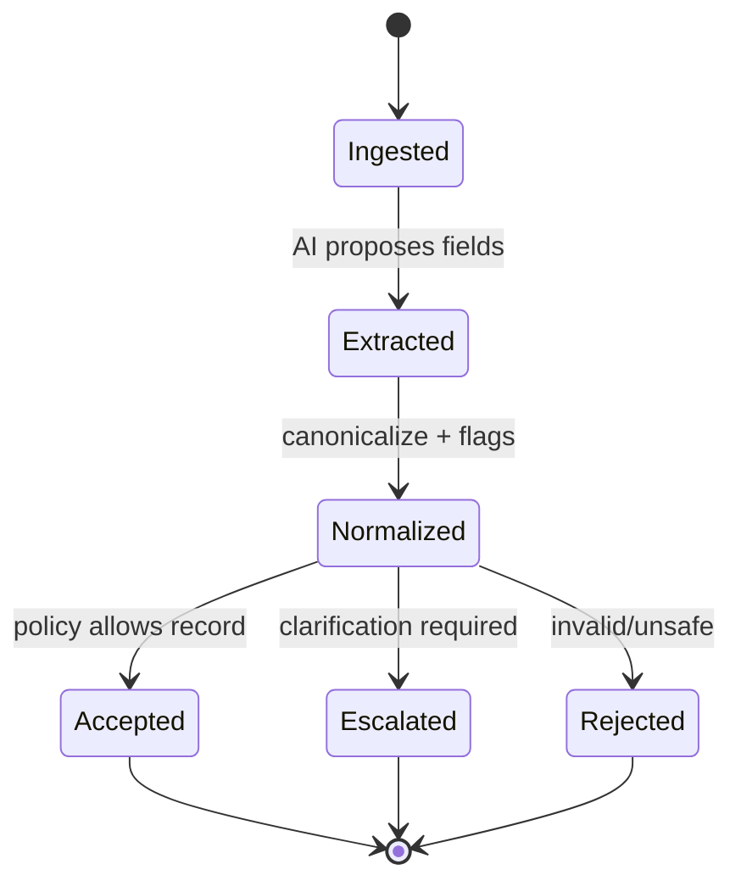
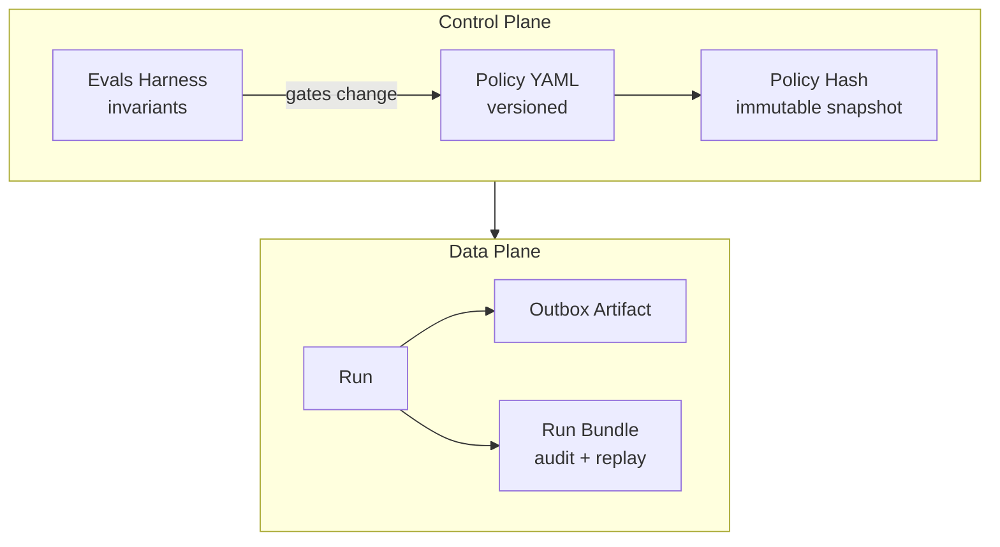

# Gatekeeper — Incident Intake

Gatekeeper Incident Intake is a **policy-gated decision system** that prevents incomplete, ambiguous, or unsafe incident reports from entering systems of record.

It sits between **unstructured incident submissions** (email, forms, chat) and downstream EHS/compliance systems, enforcing deterministic outcomes:

- **ACCEPTED** → safe to create a record  
- **ESCALATED** → requires human clarification  
- **REJECTED** → invalid or unsafe submission  

AI is used only for **field extraction**. **Policy remains the authority.**

---

## Executive Summary

**Problem:** Incident intake is messy. Downstream systems cannot safely accept chaos.  
**Solution:** Gatekeeper enforces data quality, policy constraints, and auditability *before* a record exists.  
**Result:** Cleaner records, fewer escalations later, and a deterministic audit trail.

---

## What Gatekeeper Guarantees

- **No ACCEPT** without: summary, category, location, event time
- **Relative/ambiguous time** → never ACCEPT
- **Prompt injection / coercion** → REJECT
- **Taxonomy enforcement** for incident categories
- **Every run** produces replayable artifacts (input → extraction → normalization → decision)

---

## Canonical Incident Categories

Gatekeeper enforces:

- **Injury/Illness**
- **Near Miss**
- **Property Damage**
- **Motor Vehicle Accident**
- **Environmental Incident**

Out-of-taxonomy category signals are **escalated for human review**.

---

## System Architecture



**Key design rule:** AI only influences **extraction**. Everything after that is deterministic.

---

## Decision States



---

## Control Plane vs Data Plane



---

## Policy Outcomes and Responsibilities

| Outcome       | Meaning                             | Downstream Action              |
| ------------- | ----------------------------------- | ------------------------------ |
| **ACCEPTED**  | Complete + policy-compliant         | Create record                  |
| **ESCALATED** | Real incident, insufficient clarity | Human review / request details |
| **REJECTED**  | Invalid, unsafe, or non-actionable  | Do not create record           |

---

## Audit & Replay

Every run stores:

* Raw input snapshot
* Extraction candidates + evidence
* Normalized record + flags
* Policy decision + reason codes + rule IDs fired
* Policy version + policy hash (+ policy snapshot if enabled)
* Timing metadata

This supports audits, reviews, and deterministic replay months later.

---

## Evaluation & Invariants

Gatekeeper includes an eval harness that asserts invariants such as:

* Missing required fields → never ACCEPT
* Relative time → ESCALATED at most
* REJECTED outputs → must include reason codes
* Prompt injection attempts → REJECT

Run:

```bash
python -m evals.run_evals
```

---

## Quick Start

### 1) Set environment variables

**Windows PowerShell (persistent):**

```powershell
setx OPENAI_API_KEY "YOUR_KEY"
setx GATEKEEPER_POLICY_VERSION "v1"
setx GATEKEEPER_MODEL "gpt-4o-mini"
```

Restart your terminal after `setx`.

### 2) Install dependencies

```bash
pip install -r requirements.txt
```

### 3) Run CLI

```bash
python -m app.main
```

---

## What Gatekeeper Is Not

* Not a chatbot
* Not an assistant
* Not a recommendation engine
* Not a RAG demo
* Not a model showcase

Gatekeeper is **decision infrastructure**.

---

## Status

**v1 — Incident Intake**
Policy-gated • Eval-backed • Audit-grade • UI-agnostic
