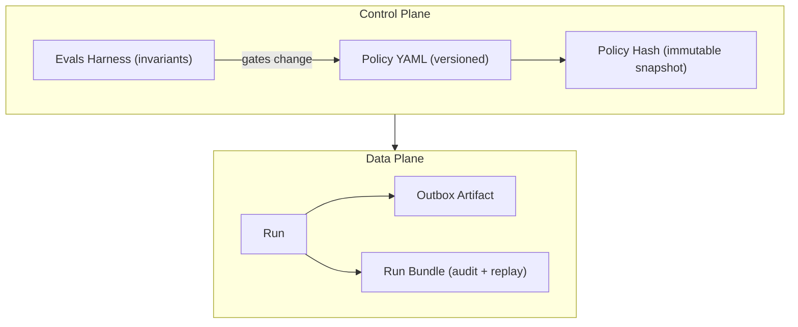

# Gatekeeper — Architecture (Incident Intake v1)

This document describes the architecture of **Gatekeeper Incident Intake**, a deterministic, policy-gated decision system that prevents incomplete, ambiguous, or unsafe incident submissions from entering systems of record.

**Design invariant:** AI is used only for **field extraction**. All normalization, decisioning, refusal, and escalation are deterministic and policy-driven.

---

## 1) System Overview

Gatekeeper sits between unstructured incident intake channels (email, forms, chat) and downstream EHS/compliance systems.

It enforces one of three outcomes for every submission:

- **ACCEPTED** — safe to create a record
- **ESCALATED** — requires human clarification
- **REJECTED** — invalid or unsafe submission

Gatekeeper produces **durable, replayable artifacts** for every run.

---

## 2) Core Pipeline

```mermaid
flowchart TB
  A["Unstructured Intake"] --> B["Ingest"]
  B --> C["AI Extraction"]
  C --> D["Normalization"]
  D --> E["Policy Gate"]

  E -->|ACCEPTED| F["Accepted Artifact"]
  E -->|ESCALATED| G["Escalation Required"]
  E -->|REJECTED| H["Rejected Submission"]

  B -.-> I["Run Bundle Audit & Replay"]
  C -.-> I
  D -.-> I
  E -.-> I
````

### Responsibilities

**Ingest**

* Captures `raw_text` exactly as received
* Associates metadata (source, submitted_by, etc.)
* Generates a `run_id`

**AI Extraction**

* Proposes candidate fields and evidence excerpts
* May return unknowns or multiple candidates
* Must not invent missing data
* Must not decide outcomes

**Normalization (Deterministic)**

* Canonicalizes extracted candidates into a normalized record
* Enforces schema types and required fields
* Produces quality flags for ambiguity (e.g., relative time unresolved)
* Never guesses to “make it pass”

**Policy Gate (Deterministic)**

* Evaluates versioned rules from policy YAML
* Emits a decision + reason codes + rule IDs fired
* Produces required next actions for ESCALATED / REJECTED outcomes

**Artifacts**

* Outbox JSON artifact written to `outbox/<decision>/`
* Run bundle written to `runs/<run_id>/` for audit and replay

---

## 3) Domain Constraints (Incident Intake v1)

### Canonical Incident Categories

Gatekeeper enforces these categories:

* **Injury/Illness**
* **Near Miss**
* **Property Damage**
* **Motor Vehicle Accident**
* **Environmental Incident**

Out-of-taxonomy category signals are **escalated for human review**.

### Required Fields for ACCEPT

Gatekeeper v1 requires:

* `summary`
* `category`
* `location`
* `event_time`

If required fields are missing, the submission is not eligible for ACCEPT.

---

## 4) Decision Lifecycle

```mermaid
stateDiagram-v2
  [*] --> Ingested
  Ingested --> Extracted: AI proposes fields
  Extracted --> Normalized: canonicalize + flags
  Normalized --> Accepted: policy allows record
  Normalized --> Escalated: clarification required
  Normalized --> Rejected: invalid/unsafe
  Accepted --> [*]
  Escalated --> [*]
  Rejected --> [*]
```

---

## 5) Policy & Governance

Gatekeeper’s behavior is controlled by a **versioned policy YAML**. The policy engine is deterministic and order-aware: the first matching rule applies.

### Control Plane vs Data Plane



### Policy Outcomes

| Outcome       | Meaning                             | Downstream Action              |
| ------------- | ----------------------------------- | ------------------------------ |
| **ACCEPTED**  | Complete + policy-compliant         | Create record                  |
| **ESCALATED** | Real incident, insufficient clarity | Human review / request details |
| **REJECTED**  | Invalid, unsafe, or non-actionable  | Do not create record           |

---

## 6) Audit & Replay

For every run, Gatekeeper persists an audit bundle containing:

* Raw input snapshot
* Extraction candidates + evidence
* Normalized record + flags
* Policy decision + reason codes + rule IDs fired
* Policy version + policy hash (and policy snapshot if enabled)
* Timing metadata

This enables deterministic replay and post-hoc review.

---

## 7) Evaluation Harness

Gatekeeper includes evals that assert invariants such as:

* Missing required fields → never ACCEPT
* Relative time → ESCALATED at most
* REJECTED outputs → must include reason codes
* Prompt injection attempts → REJECT

Run:

```bash
python -m evals.run_evals
```

All invariants should pass before policy or engine changes are accepted.

---

## 8) What Gatekeeper Is Not

* Not a chatbot
* Not a recommendation engine
* Not an autonomous agent
* Not a model showcase

Gatekeeper is **decision infrastructure**: it enforces policy boundaries and produces audit-grade artifacts.


### Create the file
In PowerShell from repo root:

```powershell
mkdir docs
notepad docs\ARCHITECTURE.md
````

(or create it in VS Code Explorer).

